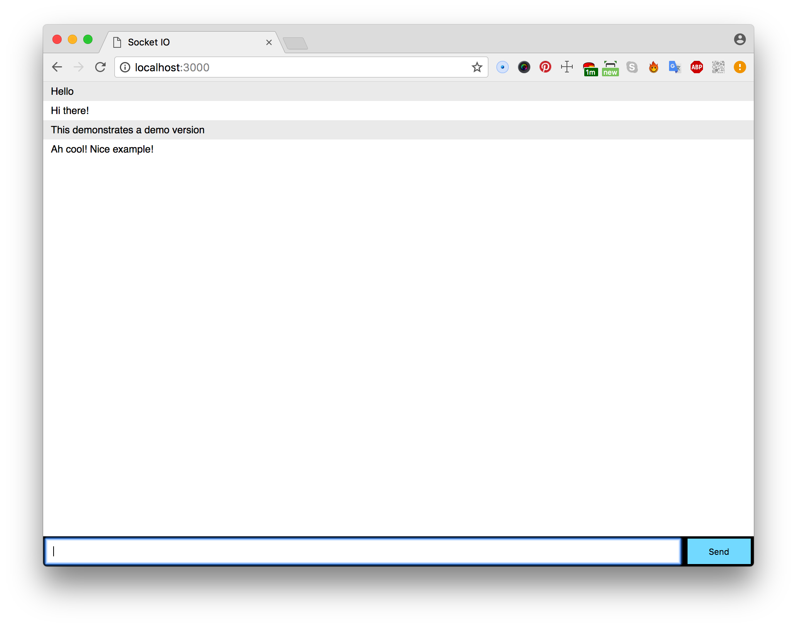

# Chat application

This application is a real-time chat room. People are able to communicate with each other when they are on the same URL at the same time.




## How to install
First of all, clone the repo git clone

Install dependencies
``` npm install```

Run ``` node app.js ```
(Or fix TODO 1, it will change to `npm start`)
to start the server on port 3000.

## Features and tooling
- [x] Server: express
- [x] Templating: EJS
- [x] Real-time: Socket.io

## Week 1 progress
#### Socket.io
Figuring out socket.io and following the chat tutorial. Refactored the jQuery examples to vanilla JS so that I didn't need to use the jQuery library.

Reality check, ```('chat message')``` and ```('chat message:')``` are completely different. I need to pay more attention to these subtle typo's.

#### TO DO:
1. Add a NPM script to start the application
2. Add user names to the chat messages (you can find this in the tutorial)
2. Add some new functionality for the chat app
